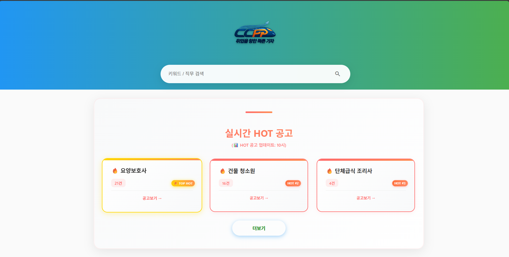
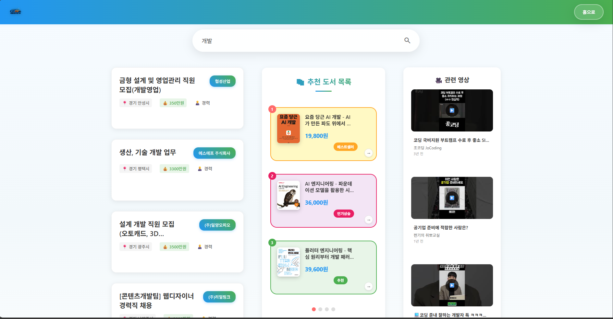
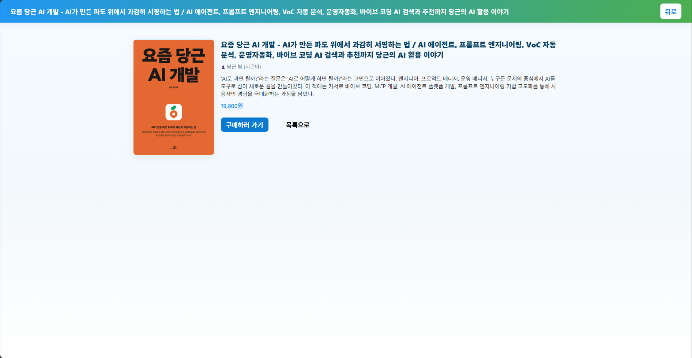
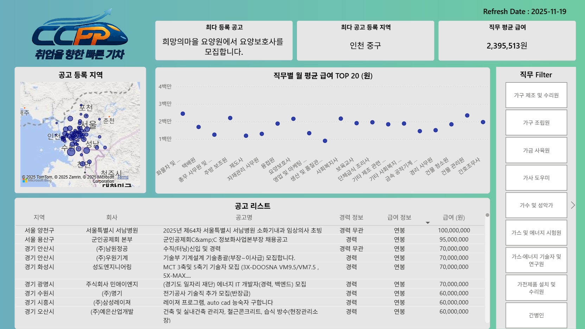

# Book Recommendation Platform 📚

## 개요  
이 저장소는 **직무/기술 트렌드 기반 도서 추천 플랫폼** 프로젝트를 위한 코드 및 문서 저장소입니다.  
구직 게시글 데이터를 실시간으로 수집 · 처리하여 직무 및 기술 트렌드를 분석하고, 이를 기반으로 도서와 유튜브 영상을 추천하는 서비스입니다.

## 특징  
- Azure 기반 데이터 파이프라인 설계 및 구현 (Functions → Blob Storege → Event Hubs → Stream Analytics → PostgreSQL / PowerBI → Web)  
- Power BI를 이용한 대시보드 시각화  
- 직무 / 기술 트렌드 분석 → 도서 추천 → 학습자료 연계라는 엔드-투-엔드 흐름  
- 사용자가 익숙한 추천 플랫폼과 유사하게 “이런 기술이 뜨고 있어요 → 이런 책과 영상이 있어요” 형태로 제공
  

## 프로젝트 정보  
- **프로젝트명** : 직무/기술 트렌드 기반 도서 및 유튜브 영상 추천 플랫폼  
- **저장소 주소** : `https://github.com/CCPP-1st-team/Book-Recommendation-Platform.git`  
- **프로젝트 기간** : 2025.11.10. ~ 2025.11.20
- **팀원** : 팀장 : 이정윤 · 팀원 : 고경수, 고승균, 김혁수, 조민기
- **개발 환경 및 언어** :
  
| Technology         | Version   | Purpose                                                |
|-------------------|-----------|--------------------------------------------------------|
| Node.js           | 22.21.0   | Required engine version for the backend and scripts.  |
| Python            | 3.11.9    | Auxiliary scripting or environment setup tasks.       |
| React             | 18.2.0    | Frontend UI library.                                  |
| React-Router-Dom  | 6.14.1    | Declarative routing for React.                        |
| Express           | 5.1.0     | Backend web framework (Server).                       |
| OpenAI            | 6.9.0     | API client for integrating AI services.               |
| PostgreSQL (pg)   | 8.16.3    | Connector for PostgreSQL database interaction.        |

- **DB 설계** :
  
| 📦 테이블 이름                    | 📝 주요 역할 및 설명                                       | 🔑 핵심 컬럼                                                     |
| ---------------------------- | --------------------------------------------------- | ------------------------------------------------------------ |
|  aladin_category          | 알라딘 상품의 카테고리 정보를 저장합니다. depth1부터 depth5까지의 상세 경로 제공 | cid (PK), category_nm, full_path                             |
|  aladin_category_embedding | 카테고리 경로를 나타내는 벡터 임베딩을 저장합니다. 검색/추천 시스템용 데이터         | cid (FK), full_path, embedding                               |
|  job_classification        | 직무 분류의 기준이 되는 공통 코드와 명칭을 저장                         | rcrit_jssfc_cmmn_code_se, job_name                           |
|  job_total_info            | 실제 채용 공고의 전체 상세 정보를 담고 있음. 임금, 지역, 경력 조건 등 포함       | company, job_title, rcrit_jssfc_cmmn_code_se, wage_value_krw |
|  jobinfo                   | 직무 분류 코드별 이벤트 수와 처리 시간을 집계 (예: 직무별 공고 발생 횟수)        | rcrit_jssfc_cmmn_code_se, event_count, eventprocessedutctime |

  
 

## 주요 구성  
- `github/workflows` : GitHub Actions를 사용한 Azure Static Web Apps 배포 및 빌드 자동화 CI/CD 파이프라인 코드
- `seoul-job-cnt` : 서울시 일자리 API 데이터 가져온 뒤 전처리 코드 
- `web` : 웹 페이지 기능 구현과 디자인 요소 정의

## 사용한 API 정보
- 서울시 일자리포털 채용 정보 : `https://data.seoul.go.kr/dataList/OA-13341/A/1/datasetView.do;jsessionid=FC12E0AF70B1C5BB5F89294A1F9DF3E2.new_portal-svr-11`
- 알라딘 책 정보 : `https://blog.aladin.co.kr/openapi/popup/6695306`
- 유튜브 API : `https://www.googleapis.com/youtube/v3`
  

## web 페이지

### 메인 화면

> 직무/기술 트렌드 추천 플랫폼의 첫 화면. 직관적인 UI로 최신 기술 트렌드를 보여줍니다.

### 검색창

> 사용자가 관심 있는 기술/직무를 검색할 수 있는 입력창과 필터 기능 제공.

### 책 정보

> 추천 도서 및 유튜브 학습 자료 정보를 확인할 수 있는 상세 페이지.

### PowerBI 대시보드

> 시각화 자료 제공.

